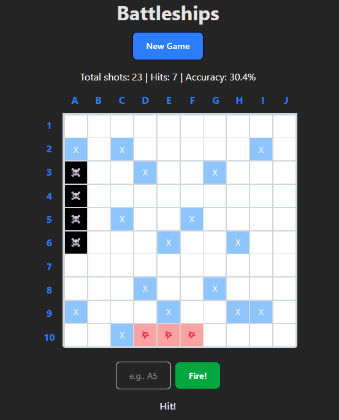

# Battleships Game

A React-based implementation of 1-sided Battleships, built with TypeScript and Tailwind.

## Getting Started

1. Clone the repository
2. Install dependencies:
```bash
npm install
```
3. To run:
```bash
npm run dev
```
4. Open your browser to the URL shown in the terminal: (`http://localhost:5173`)

## Features

1. The game starts with 3 ships randomly placed on the board
   - 1 Battleship (5 cells)
   - 2 Destroyers (4 cells each)

2. Input coordinates (e.g., "A5") in the text field or click directly on cells to fire

3. The game will indicate:
   - Miss: Empty cell
   - Hit: Ship was hit
   - Sunk: All cells of a ship have been hit
   Or error message for invalid coordinates

## Project Structure

- `src/models/` - Game logic
- `src/components/` - UI components
- `src/types/index.ts` - TS types

## Running Tests

```bash
npm test           
```

## To do:

- Add more tests to cover game logic and UI checks
- Implement Redux for state management
- Keep state on refresh 
- Add error handling / improvement if attemptShipPlacement continiously fails
- Add visualisation of game progress (ships left to sink)
- Add accessiblity features and screen reader support
- Add keyboard navigation


